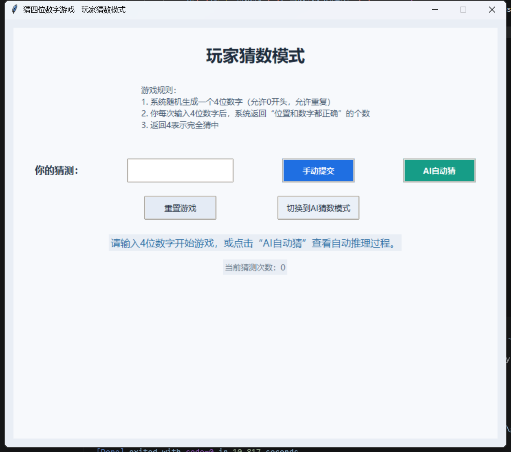
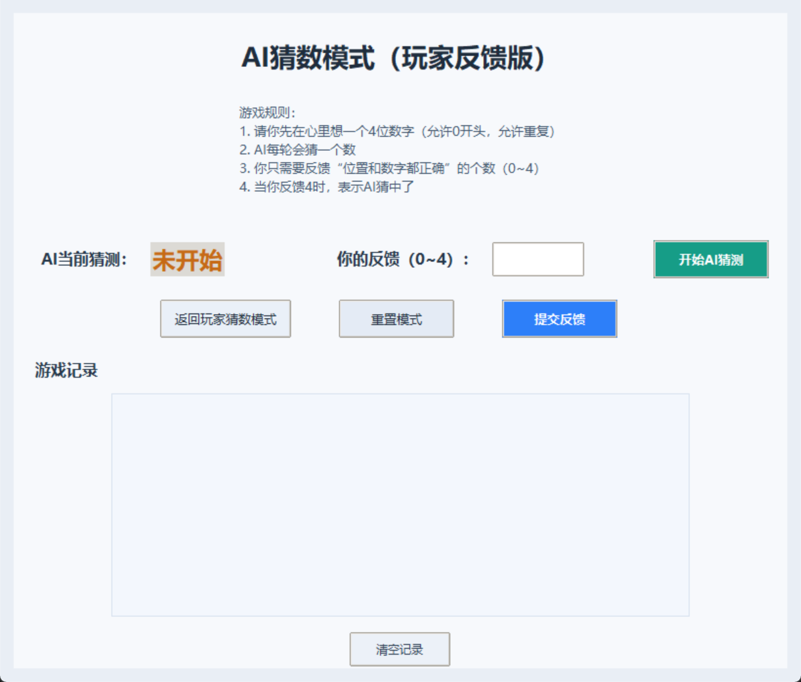

# Guess-the-number-game

[中文](#中文) | [English](#english)

---

## 中文

### 项目简介

这是一个使用 **Python** 与 **Tkinter** 开发的桌面猜数字小游戏，包含两种模式：
- 玩家猜数模式（系统出题，玩家猜测）
- AI 猜数模式（玩家心里想数，AI 逐步猜测）

项目适合用于学习与练习：
- Python GUI 开发
- 基础游戏逻辑设计
- 候选集合过滤思路

### 功能特性

- 基于 **Python 3.8+** 与 **Tkinter**
- 提供简洁直观的图形界面
- 支持玩家猜数与 AI 猜数双模式切换
- 对输入内容进行校验（猜测值、反馈值）
- 实时反馈猜测结果
- 提供 AI 猜测历史记录面板
- 支持模式重置与记录清空

### 快速开始

#### 环境要求

- Python 3.8 或更高版本

#### 运行方式

```bash
python guess_game.py
```

### 游戏规则

#### 玩家猜数模式

1. 系统随机生成一个 4 位数字。
2. 允许 0 开头。
3. 允许数字重复。
4. 每次输入后，程序会返回“数字和位置都正确”的个数。
5. 返回值为 `4` 时表示完全猜中。

#### AI 猜数模式

1. 玩家先在心里想一个 4 位数字。
2. AI 每轮给出一个猜测。
3. 玩家输入 `0` 到 `4` 的反馈值，表示“数字和位置都正确”的个数。
4. AI 根据反馈过滤候选池并继续猜测。
5. 当反馈为 `4` 时，表示 AI 猜中。

### 界面截图





### 项目结构

```text
Guess-the-number-game/
├── guess_game.py
├── README.md
└── assets/
    ├── 1.png
    └── 2.png
```

---

## English

### Introduction

This is a desktop number-guessing game built with **Python** and **Tkinter**, with two modes:
- Player Guess Mode (the system generates a number, the player guesses)
- AI Guess Mode (the player thinks of a number, and the AI guesses step by step)

This project is suitable for learning and practicing:
- Python GUI development
- Basic game logic design
- Candidate-set filtering strategies

### Features

- Built with **Python 3.8+** and **Tkinter**
- Clean and intuitive graphical interface
- Supports switching between Player Guess Mode and AI Guess Mode
- Input validation for guesses and feedback values
- Real-time result feedback
- AI guessing history record panel
- Reset support and record clearing

### Quick Start

#### Requirements

- Python 3.8 or higher

#### Run

```bash
python guess_game.py
```

### Game Rules

#### Player Guess Mode

1. The system randomly generates a 4-digit number.
2. Leading zeros are allowed.
3. Repeated digits are allowed.
4. After each guess, the program returns how many digits are both correct and in the correct position.
5. A return value of `4` means the player wins.

#### AI Guess Mode

1. The player thinks of a 4-digit number.
2. The AI makes one guess per round.
3. The player provides feedback from `0` to `4`, indicating how many digits are correct and in the correct position.
4. The AI filters the candidate pool based on feedback and continues guessing.
5. A feedback value of `4` means the AI has guessed correctly.

### Screenshots


### Project Structure

```text
Guess-the-number-game/
├── guess_game.py
├── README.md
└── assets/
    ├── 1.png
    └── 2.png
```
